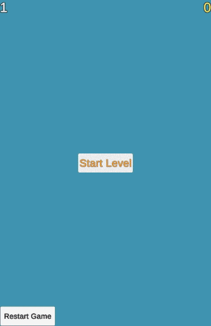
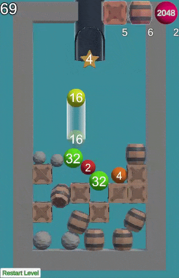
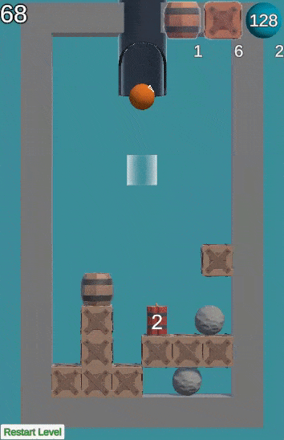

# Shooting-Balls

## Supporting documentation
At the moment the game has:
* Using Scriptable Object
* Using the basic principles of OOP
* Save System
* System for setting tasks per level
* Bonuses (dynamite, star)
* Items to collect (box, barrel, stone)
* Pickup items animation
* Bonus Animation

## Gameplay preview

---

---

